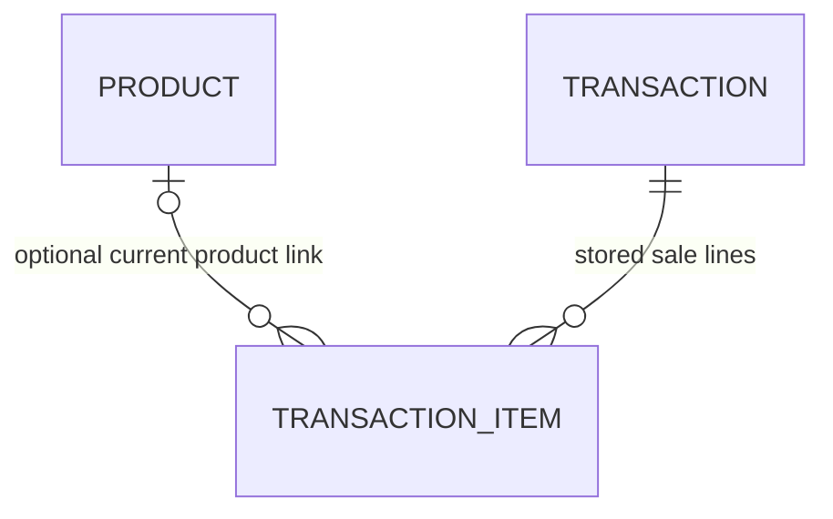

# Common Table data foundation - Prompt 05

Implemented locally on `catalog-data`, based on UI evidence commit `3ce83e25975870cc8fbadb42c3267086729117d7`. SQLite is the accepted exam storage choice. This stage creates tables and seed data, not a working cart or payment flow. Requester: M3 Magos, assisted by Codex; member explanation/independent review remain pending.



The diagram describes database links. Future completion must require a nonempty order and create a header plus all its lines together; the schema alone does not require at least one line or verify its total equals their sum.

## Product fields

| Field | Why it exists |
| --- | --- |
| `id` | Database-generated internal identifier; future cart stores this ID rather than browser prices |
| `seed_key` | Unique stable seed identity, such as rice-bowl; prevents duplicate seeding |
| `name` | Current display name, up to 100 characters |
| `description` | Optional short card description, up to 160 characters |
| `price` | Current positive unit price; DecimalField, two decimal places, up to PHP 999,999.99 |
| `is_available` | Selectable flag, without stock/inventory management |

## Completed Transaction fields

| Field | Why it exists |
| --- | --- |
| `id` | Internal database sale ID; future session records the authorized active sale |
| `reference` | Unique public receipt reference, `CT-` plus 32 generated UUID hex characters; not an access credential |
| `payment_attempt` | Unique UUID supplied by the future reviewed-order flow; database duplicate-payment guard. No fresh default on retry |
| `customer_context` | UUID supplied by the current customer session; future receipt/reset guards must compare it |
| `completed_at` | Timezone-aware completion timestamp; future display uses Asia/Singapore |
| `payment_method` | One of cash, qr or card, with customer-friendly labels |
| `total` | Positive stored order total; two decimals, maximum PHP 99,999,999.99 |
| `amount_paid` | Stored paid amount covering the total, within the same limit |
| `change` | Nonnegative stored change, within the same limit; Python validation requires paid minus total |

Only completed-sale records are planned here. No pending bank authorization, credentials, customer account or real payment data is stored. QR/card require amount paid equal to total and zero change. Unique attempt/reference constraints prevent duplicates at the storage level; returning the existing authorized sale on a repeated request is future service work.

## TransactionItem fields

| Field | Why it exists |
| --- | --- |
| `id` | Internal line ID; preserves deterministic line order |
| `transaction` | Required sale link, with related name items; PROTECT prevents deleting a sale while lines remain |
| `product` | Optional current catalog link; SET_NULL on product deletion preserves sale history |
| `product_name` | Name copied when the sale completes; later catalog renaming does not change it |
| `unit_price` | Two-decimal price copied at completion, independent of later catalog prices |
| `quantity` | Positive integer, 1-99 per line |
| `subtotal` | Two-decimal stored line amount; Python validation requires unit price times quantity |

The limits are implementation choices for this local kiosk, not professor-specified amounts. No quantity or payment UI exists yet. Future request parsing must strictly reject fractional/boolean quantities rather than relying on model field coercion alone.

## Decimal and validation boundaries

Use Python Decimal created from strings/database values for arithmetic. DecimalField validation rejects invalid/non-finite money, excess fractional digits and out-of-range values. Database constraints also enforce positive amounts, bounded quantities, supported methods, payment coverage and exact QR/card payment. Tests exercise values retrieved from SQLite, including 0.10 + 0.20 = 0.30.

Exact cash-change and line-subtotal arithmetic is checked in model clean(), using Python Decimal, rather than floating-point SQL expressions. Call full_clean() before saving each model in the future shared completion service: Django save()/objects.create() do not automatically run full_clean(), and direct SQL/update can bypass Python checks. Cross-row order-total consistency and immutable application behavior are not yet implemented. Snapshots persist independently of catalog edits, but this schema does not prohibit a programmer from editing history.

Relevant official sources reviewed for installed Django 6.1: [fields](https://docs.djangoproject.com/en/6.1/ref/models/fields/), [constraints](https://docs.djangoproject.com/en/6.1/ref/models/constraints/), [SQLite limitations](https://docs.djangoproject.com/en/6.1/ref/databases/#sqlite-notes), and [atomic transactions](https://docs.djangoproject.com/en/6.1/topics/db/transactions/). SQLite has decimal/locking limitations; the planned small local kiosk does not claim multi-terminal concurrency guarantees.

## Shared calculation and completion plan

Prompt 06 will introduce one trusted order-calculation function: validate product IDs and integer quantities, fetch available products, calculate Decimal line subtotals and total from those records, and return the lines plus total. It will handle an empty cart as zero for selection; checkout must reject empty orders. Selection, review and all payment methods will use the same function. Client-submitted prices/totals will never be used.

Prompt 07 will tie a reviewed-order fingerprint/revision and attempt UUID to the session. Prompt 08 will introduce one shared atomic completion service used by cash and later QR/card:

1. Validate active customer context, attempt, reviewed facts, method, current products and nonempty order. Reject stale or completed/reset contexts.
2. Calculate fresh trusted values; validate cash or assign QR/card paid=total and change=0. Check model limits and exact arithmetic.
3. Inside transaction.atomic(), validate/save the sale header and every snapshotted item; require total to equal the lines. Roll back all writes on failure.
4. Handle uniqueness conflicts after rollback. An existing attempt may return its original sale only for the authorized active context. A new reference collision may retry reference generation. A database-busy error is a failure to retry, never a success response.
5. Set the session's active completed-sale ID only after successful storage. Receipt reads stored snapshots. No completed sale or success reference is shown for invalid payment.

These are planned responsibilities, not verified endpoint behavior. Current tests establish uniqueness and atomic database rollback; they do not implement idempotent HTTP payment handling, session authorization or race handling.

## Cart versus sale lifetime

The session cart is temporary: product-ID/quantity pairs, customer UUID, revision and reviewed/attempt state. Store JSON-safe values, not Decimal objects. The catalog and completed sale/item snapshots persist in SQLite.

New Transaction will clear the active cart, review/payment/receipt pointers, create a new customer context and rotate the session ID. It will retain completed database rows. Historical receipt access will still require the active session/context; neither reset nor history protection is implemented in this stage.

## Reproduce this milestone

```powershell
.\venv\Scripts\python.exe scripts/init_env.py
.\venv\Scripts\python.exe manage.py migrate
.\venv\Scripts\python.exe manage.py seed_catalog
.\venv\Scripts\python.exe manage.py seed_catalog
.\venv\Scripts\python.exe manage.py test kiosk
.\venv\Scripts\python.exe manage.py check
.\venv\Scripts\python.exe manage.py makemigrations --check --dry-run
```

The seed creates missing agreed products only. Repetition preserves IDs, price/name edits, unavailable flags, unrelated products and completed sales. It does not reset the catalog. The first local run created six, the second created zero and preserved six. No existing database was deleted. Django tests used a separate in-memory SQLite database; local sales/items remain zero. Initial migration is newly generated, not a rewrite of an applied migration.

Prompt 05 is recorded as a02288bca6d1fda50cfea7191066b25cf47e46e2 on catalog-data and pushed in the later authorized checkpoint. [PR #3](https://github.com/Yray0-9/pos-app/pull/3) is open into codex/ui-foundation; UI evidence parent 3ce83e2 is now pushed. Genuine non-author review remains pending; no merge or cart work. Combined E is next within this checkpoint.
