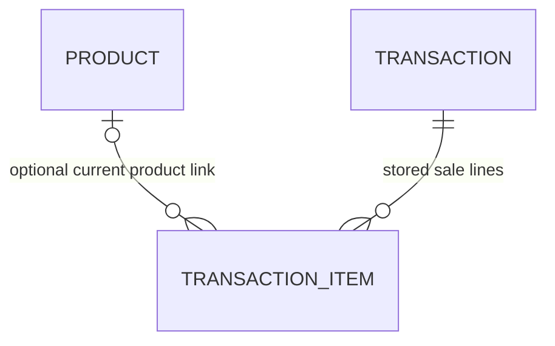

# Common Table data, cart and completed transactions

## Current architecture — no database (supersedes earlier SQLite plan)

Latest user request explicitly rejected SQLite and requested deleting it. The root
db.sqlite3 (including three earlier HTTP test sales) was deleted after checking its
absolute workspace path. It is not deployed. DATABASES={} uses Django's dummy backend;
no admin/auth/session-model apps remain. No migrate or seed command is necessary.

- kiosk/catalog.py defines six frozen products: stable integer ID, key, name,
  description, Decimal price and availability. It is trusted server code.
- kiosk/cart.py computes subtotal=price×quantity and total=sum(subtotals), with integer
  quantities 1–99, explicit removal/repair, and no posted price/total authority.
- Django signed-cookie sessions contain cart/context/revision, confirmed facts,
  payment UUID and the active completed receipt. Values are JSON-safe strings/integers.
- The receipt snapshots product name/unit price/quantity/subtotal, total, amount paid,
  change, method, timezone-aware completed_at and CT-<payment UUID hex> reference.
  Frozen Sale/SaleItem objects are reconstructed only after consistency validation.
- Review and payment use the same current calculator. Signed tokens bind context,
  revision, items, prices, method and attempt. Invalid/stale/empty payment cannot succeed.
- Serial retries using the current cookie return the same snapshot and original paid
  amount; another method cannot replace it. Cash is strict two-decimal positive money
  covering total; QR/Card paid=total and change=0. All payments are simulations.
- New Transaction clears this browser's cart/review/payment/receipt and gives a fresh
  context. Ordinary old URLs/tokens with the new cookie are denied. There is no sales
  history to delete or preserve, and closing/expiring/losing cookies loses active state.

**Limits:** signed cookies are authenticated, not encrypted. No customer identity,
card data or banking credentials are collected. A copied old signed cookie can be
replayed until expiry; reset cannot revoke that copy without shared server storage.
Separate precompletion cookies produce the same attempt reference but cannot globally
lock conflicting simultaneous amounts/methods. No durable exactly-once payment or
historical ledger guarantee is claimed. Tests explicitly expose these limitations.
Cookie lifetime is two hours/browser session; six-line quantity-99 receipt fits 4096 bytes.

Archived original models, applied migration, seed and old tests are retained under
docs/archive/sqlite-foundation as inactive historical source. They are not imported,
installed as migrations, executed or deployed. Existing Git history is not rewritten.
The earlier sections below describe the superseded SQLite implementation only.

Reference: [Django signed-cookie sessions and replay/size limitations](https://docs.djangoproject.com/en/6.1/topics/http/sessions/).

## Historical SQLite decisions and implementation

Implemented locally on `catalog-data`, based on UI evidence commit `3ce83e25975870cc8fbadb42c3267086729117d7`. SQLite is the accepted exam storage choice. Prompt 05 created tables and seed data; later local completion now implements cart, review and all simulated payments. Earlier stage-specific observations below preserve history; the final section describes current behavior. Requester: M3 Magos, assisted by Codex; member explanation/independent review remain pending.



The diagram describes database links. Future completion must require a nonempty order and create a header plus all its lines together; the schema alone does not require at least one line or verify its total equals their sum.

## Product fields

| Field | Why it exists |
| --- | --- |
| `id` | Database-generated internal identifier; future cart stores this ID rather than browser prices |
| `seed_key` | Unique stable seed identity, such as rice-bowl; prevents duplicate seeding |
| `name` | Current display name, up to 100 characters |
| `description` | Optional short card description, up to 160 characters |
| `price` | Current positive unit price; DecimalField, two decimal places, up to PHP 999,999.99 |
| `is_available` | Selectable flag, without stock/inventory management |

## Completed Transaction fields

| Field | Why it exists |
| --- | --- |
| `id` | Internal database sale ID; future session records the authorized active sale |
| `reference` | Unique public receipt reference, `CT-` plus 32 generated UUID hex characters; not an access credential |
| `payment_attempt` | Unique UUID supplied by the future reviewed-order flow; database duplicate-payment guard. No fresh default on retry |
| `customer_context` | UUID supplied by the current customer session; future receipt/reset guards must compare it |
| `completed_at` | Timezone-aware completion timestamp; future display uses Asia/Singapore |
| `payment_method` | One of cash, qr or card, with customer-friendly labels |
| `total` | Positive stored order total; two decimals, maximum PHP 99,999,999.99 |
| `amount_paid` | Stored paid amount covering the total, within the same limit |
| `change` | Nonnegative stored change, within the same limit; Python validation requires paid minus total |

Only completed-sale records are planned here. No pending bank authorization, credentials, customer account or real payment data is stored. QR/card require amount paid equal to total and zero change. Unique attempt/reference constraints prevent duplicates at the storage level; returning the existing authorized sale on a repeated request is future service work.

## TransactionItem fields

| Field | Why it exists |
| --- | --- |
| `id` | Internal line ID; preserves deterministic line order |
| `transaction` | Required sale link, with related name items; PROTECT prevents deleting a sale while lines remain |
| `product` | Optional current catalog link; SET_NULL on product deletion preserves sale history |
| `product_name` | Name copied when the sale completes; later catalog renaming does not change it |
| `unit_price` | Two-decimal price copied at completion, independent of later catalog prices |
| `quantity` | Positive integer, 1-99 per line |
| `subtotal` | Two-decimal stored line amount; Python validation requires unit price times quantity |

The limits are implementation choices for this local kiosk, not professor-specified amounts. Prompt 06 now provides quantity controls and strict cart parsing that rejects fractional/boolean session quantities. Payment UI remains future work; model field coercion alone is not the cart validation boundary.

## Decimal and validation boundaries

Use Python Decimal created from strings/database values for arithmetic. DecimalField validation rejects invalid/non-finite money, excess fractional digits and out-of-range values. Database constraints also enforce positive amounts, bounded quantities, supported methods, payment coverage and exact QR/card payment. Tests exercise values retrieved from SQLite, including 0.10 + 0.20 = 0.30.

Exact cash-change and line-subtotal arithmetic is checked in model clean(), using Python Decimal, rather than floating-point SQL expressions. Call full_clean() before saving each model in the future shared completion service: Django save()/objects.create() do not automatically run full_clean(), and direct SQL/update can bypass Python checks. Cross-row order-total consistency and immutable application behavior are not yet implemented. Snapshots persist independently of catalog edits, but this schema does not prohibit a programmer from editing history.

Relevant official sources reviewed for installed Django 6.1: [fields](https://docs.djangoproject.com/en/6.1/ref/models/fields/), [constraints](https://docs.djangoproject.com/en/6.1/ref/models/constraints/), [SQLite limitations](https://docs.djangoproject.com/en/6.1/ref/databases/#sqlite-notes), and [atomic transactions](https://docs.djangoproject.com/en/6.1/topics/db/transactions/). SQLite has decimal/locking limitations; the planned small local kiosk does not claim multi-terminal concurrency guarantees.

## Shared calculation and completion plan

Prompt 06 introduced calculate_order in kiosk/cart.py: validate product IDs and integer quantities, fetch available products, calculate Decimal line subtotals and total, and return lines plus total/recovery flags. Empty selection totals zero; review/checkout must reject empty orders when introduced. Future review and all payment methods must reuse this helper. Client-submitted prices/totals are never used. See the implemented cart section below for recovery and session details.

Prompt 07 will tie a reviewed-order fingerprint/revision and attempt UUID to the session. Prompt 08 will introduce one shared atomic completion service used by cash and later QR/card:

1. Validate active customer context, attempt, reviewed facts, method, current products and nonempty order. Reject stale or completed/reset contexts.
2. Calculate fresh trusted values; validate cash or assign QR/card paid=total and change=0. Check model limits and exact arithmetic.
3. Inside transaction.atomic(), validate/save the sale header and every snapshotted item; require total to equal the lines. Roll back all writes on failure.
4. Handle uniqueness conflicts after rollback. An existing attempt may return its original sale only for the authorized active context. A new reference collision may retry reference generation. A database-busy error is a failure to retry, never a success response.
5. Set the session's active completed-sale ID only after successful storage. Receipt reads stored snapshots. No completed sale or success reference is shown for invalid payment.

These are planned responsibilities, not verified endpoint behavior. Current tests establish uniqueness and atomic database rollback; they do not implement idempotent HTTP payment handling, session authorization or race handling.

## Cart versus sale lifetime

The session cart is temporary: product-ID/quantity pairs, customer UUID, revision and reviewed/attempt state. Store JSON-safe values, not Decimal objects. The catalog and completed sale/item snapshots persist in SQLite.

New Transaction will clear the active cart, review/payment/receipt pointers, create a new customer context and rotate the session ID. It will retain completed database rows. Historical receipt access will still require the active session/context; neither reset nor history protection is implemented in this stage.

## Reproduce this milestone

```powershell
.\venv\Scripts\python.exe scripts/init_env.py
.\venv\Scripts\python.exe manage.py migrate
.\venv\Scripts\python.exe manage.py seed_catalog
.\venv\Scripts\python.exe manage.py seed_catalog
.\venv\Scripts\python.exe manage.py test kiosk
.\venv\Scripts\python.exe manage.py check
.\venv\Scripts\python.exe manage.py makemigrations --check --dry-run
```

The seed creates missing agreed products only. Repetition preserves IDs, price/name edits, unavailable flags, unrelated products and completed sales. It does not reset the catalog. The first local run created six, the second created zero and preserved six. No existing database was deleted. Django tests used a separate in-memory SQLite database; local sales/items remain zero. Initial migration is newly generated, not a rewrite of an applied migration.

Prompt 05 is recorded as a02288bca6d1fda50cfea7191066b25cf47e46e2 on catalog-data and pushed in the later authorized checkpoint. [PR #3](https://github.com/Yray0-9/pos-app/pull/3) is open into codex/ui-foundation; UI evidence parent 3ce83e2 is now pushed. Genuine non-author review remains pending; no merge or cart work. The later documentation-only evidence commit 796b5da is also pushed. Combined E then created local cart-review from that complete checkpoint; no cart implementation.

## Prompt 06 trusted calculation and active cart implemented

kiosk/cart.py now provides calculate_order(raw_cart) for selection and future review/payment reuse. Product identifiers must be canonical positive ASCII integers within SQLite's signed 64-bit range; stored quantities must be actual integers (not booleans, floats or strings), 1-99. The helper loads available Product rows and computes Decimal unit_price x quantity for each line, then sums from Decimal 0.00. Browser money/quantity fields do not control arithmetic. Total cap is PHP 99,999,999.99, consistent with sale fields; growth beyond it is rejected, while reductions/removals allow an oversized legacy order to recover.

Session namespace kiosk contains cart (string product IDs -> integer quantities), customer_context (UUID string) and revision (integer). A valid POST creates/reuses context and increments revision; GET reads without changing cart. Nested state is reassigned to ensure session persistence; unrelated session keys are preserved. Cart edits invalidate reserved reviewed_order/payment_attempt/payment_method/cash_amount fields. Review/fingerprint/attempt construction is still Prompt 07; payment completion/receipt/reset guards remain later work.

calculate_order reports invalid/unavailable/missing entries and excludes them from displayed trusted amounts without silently saving a repaired cart. The UI offers an explicit Update order POST; valid selection edits also repair with feedback. Current DB price edits change active order amounts; completed sale snapshots remain independent. Maximum-quantity controls are disabled, and the server also rejects forged requests beyond 99. Invalid actions/products leave state unchanged.

Native POST/redirect forms and JSON server-rendered fragments share the same action handler. POST/CSRF protects edits; order responses are marked no-store. Small JavaScript serializes actions in one tab and never retries an uncertain request automatically. This does not establish cross-tab/concurrent terminal guarantees or duplicate-payment handling. No transaction rows are created by selection.

Implementation follows [Django sessions](https://docs.djangoproject.com/en/6.1/topics/http/sessions/), [CSRF guidance](https://docs.djangoproject.com/en/6.1/howto/csrf/) and [Fetch behavior](https://developer.mozilla.org/en-US/docs/Web/API/Fetch_API/Using_Fetch). Tests used a separate in-memory database. No dependency or schema changes in this stage. Current selection/cart is uncommitted on cart-review; the earlier Prompt 05 storage/code/PR records remain historical evidence.

## Combined completion: confirmed state and durable sales

All screens and methods reuse calculate_order for trusted Decimal totals. The review signer binds context UUID, cart revision, IDs/names/prices/quantities/subtotals/total to the displayed order; CSRF-protected Continue recomputes current facts and saves JSON-safe reviewed_order plus payment_attempt UUID. Repeated unchanged confirmation reuses the attempt. Cart edits invalidate confirmation; unavailable/deleted/invalid entries warn and require explicit repair, and all-invalid carts explain repair before an empty state. Catalog price/name changes require re-review.

The payment token binds reviewed facts, attempt and chosen method. complete_payment validates token, session context/attempt/method and fresh facts. Cash is parsed using strict ordinary two-decimal currency syntax/range and must cover total. QR/card paid=total and change=0. A database atomic block calls model validation and writes the sale header and all item snapshots together. Unique attempt prevents duplicate completion. A retry returns the original authorized sale, not a second charge or a changed paid amount. Another method/customer cannot reuse it. SQLite write contention can return a busy error; explicit retry retains the same key. No guarantee of unrestricted simultaneous cart edits is claimed.

After completion the session holds active_reference alongside its context/attempt. owned_sale matches all three to durable records; success/receipt are unavailable to unrelated or reset sessions. Receipt is always rendered from stored line and sale fields. Product edits/deletion do not change purchased snapshots. The API exposes no unrestricted transaction-history list.

New Transaction validates the signed active receipt, uses POST/CSRF, rotates the Django session key, replaces kiosk state with empty cart/revision 0/new context, and preserves unrelated session fields. It retains Transaction/TransactionItem history and clears active confirmation/reference/payment fields. Previous cookie, reference URL and payment/reset tokens cannot reopen/clear the new customer's state. No-store views and history-restoration reload support the UI; actual browser cache behavior remains a human test.

No migration or dependency change was needed. Tests use a separate database, including rollback and concurrency cases; a new temporary SQLite migration/seed/reseed check passed. Working SQLite retains three isolated HTTP acceptance sales, not zero after completion. No working data was deleted.

References: [Django atomic transactions](https://docs.djangoproject.com/en/6.1/topics/db/transactions/), [signing](https://docs.djangoproject.com/en/6.1/topics/signing/), [sessions](https://docs.djangoproject.com/en/6.1/topics/http/sessions/).
